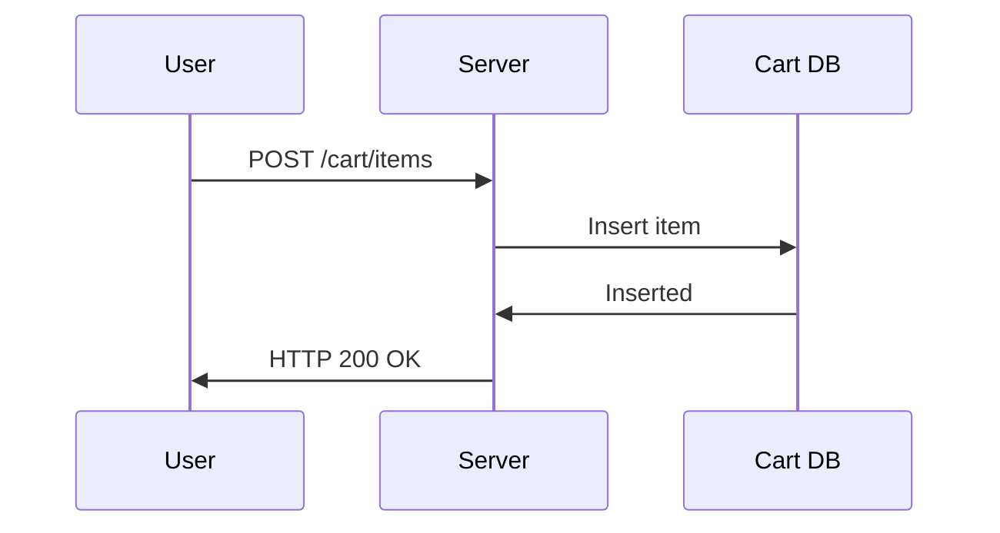
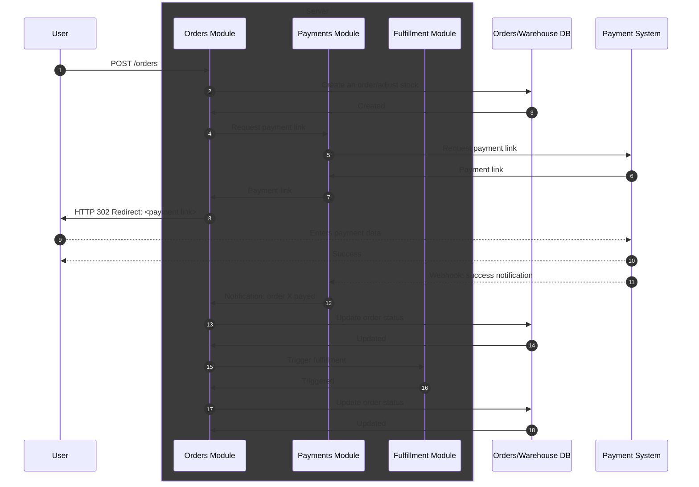

# Reasoning

## Step 1: Estimations

Based on high level predictions regarding daily amount of order, we can calculate approximate RPS(requests per second) and required storage size.

### API RPS

**Orders per day = 10 000 | 100 000 (at start | after a year)** \
Assumption: a 5% visitor-to-purchase conversion rate => **DAU=200 000 | 2 000 000** \
Assumption: a DAU/MAU ratio = 0.15(avg for mid-size online market), **MAU = 1 400 000 | 14 000 000** \
Assumption: every user visit a site at least once per month, MAU will be referred as **Total Users**. \
Assumption: a users generate ~20-150 requests per day => **Requests per day = ~6 600 000 | 65 000 000** \
Then **Total RPS(avg) = 75 | 750**.

Assumption: user activity is not consistent, the system can experience load spikes. A spike multiplier = **10** \
Then, **Total RPS(spike) = 750 | 7500**

As far as we design order processing only, we need to understand RPS for specific features related to order processing.
Assumption: RPS(cart) = Total RPS \* 0.15 => **RPS(cart avg) = 11.25 | 112.5** and **RPS(cart spike) = 112.5 | 1125** \
Assuption: RPS(checkout) = Total RPS \* 0.02 => **RPS(checkout avg) = 1.5 | 15** and **RPS(checkout spike) = 15 | 150**

### Storage

We have 2 types of entities - **cart** and **order**. \
Let's reserve **1Kb** per each entity. This estimate assumes some margin.

Assumption: At any point in time all users can have non empty cart. \
So, the system MUST store **Total Users \* 1Kb = 1 400 000 Kb | 14 000 000 Kb = 1.4Gb | 14Gb**

Assumption: the system must store orders during 180 days, after it migrates to long term archive => \
the system MUST store **Order per day \* 180 \* 1Kb = 1 800 000 Kb | 18 000 000 Kb = 1.8Gb | 18Gb** at any point in time. \
\
**Total storage: 4Gb | 40Gb**

## Step 2: API Design

Based on functional requirements, we can define an API.

Assumption - already implemented systems:

1. product availability check
2. payment process start
3. fulfillment trigger

Cart service (new):

1. POST /cart/items - add item to cart
2. PUT /cart/items/{itemId} - change amount of specific item
3. DELETE /cart/items/{itemId} - remove item from cart
4. GET /cart - returns current cart

Order service (new):

1. POST /orders - create new order

The OpenAPI spec for new endpoints: [API V1](./api_evolution/api_v1.yaml)

## Step 3: Data Modeling and DBMS Selection

Regarding to use case, 2 entities must be introduced: **cart** and **order**.

```yaml
Cart:
    id: UUID
    user_id: UUID
    items: array<CartItem>

CartItem:
    product_id: string
    quantity: integer

Order:
    id: UUID
    user_id: UUID
    cart_id: UUID
    status: enum    # "pending", "paid", "shipped"
    created_at: datetime
```

For storing Carts, I recomend document DB because of development simplicity, performance on required operations(key/index-based read/write) and easy horizontal scaling comparing with RDB.

For this case AWS Dynamo DB looks suitable. Cost: [AWS Pricing Calculator](https://calculator.aws/#/estimate?id=092e3f5f71a656ef6da9b4e98ed8064fc56cf1c7)

Alteranatives:

- Mongo DB Atlas
- Azure Cosmos DB

Regarding Orders, I recommend to store warehouse data and orders in one database, if it is possible. Preferably, RDB solution. It MUST guarantee ACID in order to avoid distributed transactions.

## Step 4: Application architecture and deployment

For this scenario I recommend to start with monolith as a solution requires minimum operational complexity and development time.

Alternatives:

- Microservices - can be considered when smth of following required: faster deploys required, team growth, unbalanced workload, tech stack differentiation.

For deployment purpose I recomend to start with AWS Elastic Beanstalk for the same reasons: operational simplicity, minimum DevOps qualification.

Alternatives:

- Managed docker environment(AWS ECS, Azure Container Instances) - can be considered for better scalability and cost optimizing, but requires more expertise
- Serverless(AWS Lambda, Azure Functions) - can be considered for non-predictable on-demand workload

### Working with cart



Other requests to cart have similar structure.

### Order



## Summary

There are brief overview of design desisions:

1. Application architecture - monolith(at start, more simple development and operation)
2. DBMS - Document-oriented for cart, relational for orders and stock
3. Store orders and stock in the same DB to ensure ACID guaranties
